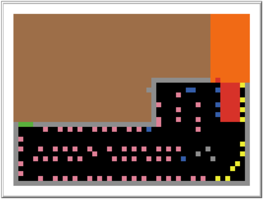

# ABMS Project

## RESEARCH PAPER PROPOSAL: [Modelling COVID-19 transmission in supermarkets using an agent-based model](https://journals.plos.org/plosone/article?id=10.1371/journal.pone.0249821)

---

---

## PURPOSE AND PATTERNS

As the main provider of food and essential goods, supermarkets remained open in many countries throughout the COVID-19 pandemic in 2020, while the majority of other businesses (such as general retail stores) shut down during periods of government-mandated lockdowns . Supermarkets represent one of the main hubs where a large number of people mix indoors throughout the pandemic and COVID-19, may be transmitted. It is therefore vital to find safe ways for customers to shop and minimize virus transmission. Models for customer dynamics and virus transmission are useful towards that goal, as they can be used to estimate the infection risk and assess how different interventions affect the risk.

Thus, we propose an agent-based model for customer dynamics which we use to estimate the total amount of exposure time, which we define as the total amount of time that customers are in close proximity to infected customers. Using a simple virus transmission model, we estimate the number of infections from exposure time. We apply this model to synthetic data and how to model the following interventions:

- Restricting the maximum number of customers in the store (MOBILITY MODEL),
We aim to find the rate of customer entering the store and at max how many customers can be present inside store at-a-time, and its dependency on the spread of virus.
- Reducing the rate at which customers enter the store (TRANSMISSION MODEL),
We focus on
- Implementing face mask policy, and
- One-way aisle store layout.

## ENTITY, STATE VARIABLES AND SCALES

### Agents

We have customers that enter the store , until store remains open.
The customers goes inside the store from entry gate, do their shopping for some time, checkout at billing area and exit from the exit door.
Initially some of the customers may/may not be infected with COVID 19 virus.
The customers randomly shop inside the shopping store going from shop to shop.

### Store graph

We represent a store as a network (called a store graph), in which nodes represent zones and edges connect contiguous zones. We create a store graph from a synthetic store layout following a similar procedure. Zones are approximately 2m by 2m and we specify a number of entrance, till, and exit nodes. We choose a network representation of a store for ease of simulation, as it significantly reduces the complexity of the model.

The coordinates of the store map are imported from " shelves.csv " file.
We added some border , entry and exit area with different colors so it is easy to simulate the customer movement and virus transmission.

### Patch

The patch coordinates are altered so that the imported coordinates of map can be easily managed within the patch size and it is visually good.

### Environment

**ENTRY AREA [ BROWN ]**
The customers spawn in the entry area. From there they move towards the store.

**ENTRY GATE [ GREEN  ]**
The customers move inside the store from the entry gate.

**SHOPPING GALLERY [ BLACK ]**
The customers roam freely and randomly in every directions and do their shopping. The path is the shopping gallery.

**SHOPS [ PINK , BLUE , GREY , YELLOW ]**
The shops are of different colors. Each color specify zones (like children section, ladies section, grocery, sports area, kitchen items etc. ).

**CHECKOUT AREA [ RED ]**
The checkout area is the billing area. After shopping their items , customers do the billing at checkout area.

**STORE BORDER [ GREY ]**
The border is the boundary of the store, so that customers roam freely inside the store and do not move out of store while shopping.

**EXIT AREA [ ORANGE ]**
Exit area is the place from where people move out of the store after shopping.

### Collectives

There may be two groups of customers, one of them non-infected and other be infected.
Non-infected one are of *white color* and infected one are of *orange color*.

## PROCESS, OVERVIEW AND SCHEDULING

Our agent-based model has four major components: a customer mobility model, a virus transmission model, face mask policy and one-way aisle layout.
The first component is the customer mobility model for how customers arrive at the store and move.
The second component is a model for how the virus transmits in the supermarket.
The third component shows the effect of using masks on the transmission of virus.
The last component shows if customers move only in one direction , then how it will affect the transmission.

### CUSTOMER - MOBILITY MODEL

In our agent-based model, customers arrive the store according to a Poisson process with constant rate "customer/min" . Each customer starts at a random entrance node (chosen uniformly at random from all entrance nodes) and follows a random shopping path.  Each shopping path is a path in the store graph, representing the route that a customer takes in the store. Two consecutive nodes in the shopping path may be identical. This case occurs when a customer picks up one or more items in the zone. A customer traverses the store graph according to its assigned shopping path. At the beginning of each simulation, the store is empty and customers arrive in the store over a period of H hours (corresponding to length of the opening hours of the store). After H hours, no new customers arrive and the simulation stops once the last customer leaves the store.

### **TRANSMISSION MODEL**

 In our model, Customer are either susceptible or infectious when they enter the store. Each customer that arrives to the store is infectious with independent probability "percentage_of_infected" (corresponding to the proportion of infectious customers) and is otherwise susceptible. In our infection mechanism, we assume susceptible customers become infected proportional to the time they spent with infectious customers. We assume that the main mode of transmission is direct transmission via respiratory droplets and neglect airborne transmission and fomite transmission. More formally, we define the *exposure time  ( sick-time )* for each susceptible customer . 

 as the total time that customer was in the same radius as an infectious customer during the shopping trip . If they have positive exposure time. Each exposed customer becomes infected after the shopping trip with probability of  "transmission-rate"  for some transmission rate . In other words, we model the infection probability of an exposed customer as a linear function of the exposure time with infectious customers. In reality, the infection probability function may take some other form (e.g., a logistic function), but for simplicity and due to lack of validated alternative models, we choose a linear function.

## DESIGN CONCEPTS

### BASIC

- The coordinates of map are imported and patch size and min, max patch coordinates are also altered so that the store map is manageable inside the patch area.
- Custom borders are made of grey color to avoid customer from moving out of the store. As initially, we had only coordinates of the shops .
    
    We used "border" function for the same by providing custom coordinates of the patches and then changing the colors of the patches to grey.
    
- Entry gates are made by changing the colors of patches to green. Function "entrygate" is used for the same.

### **CUSTOMER MOBILITY MODEL**

- **Create Customer**

We made the "add-customer" named function, that creates new customers. The customers are randomly created over the entry area. The customers have shape of "person" and have "white" color and size 1.

- **Move Customer**

After creation of the customers , the customers move towards any of the nearest entry gate. The customers stay inside the  store for atmax "time-in-store" time. 

The customer leave the store if either their shopping is done or the stay time exceeds that value , the customers move towards the exit. 

- **Restricting the maximum number of customers in store**

We restrict the maximum number *C*max of customers in a store. We can add this restriction to our model by simulating a queue outside of the store, where customers queue up if we have *C*max or more customers in the store. Customers from the queue only enter the store when the number of customers in the store is below *C*max. In our model, the estimated chance of infection and number of infections also decreases significantly when decreasing the maximum number of customers in the store. We also note that the mean number of infections plateaus as we increase the *C*max beyond 20, as the number of customers typically does not exceed 20 in our simulations

We made a variable "max-customer" for the same.

- **Reducing customer arrival rate**

Another way of reducing the number of customers in the store is to restrict the rate at which customers enter the store. We can incorporate this in our model by varying the arrival rate λ. We see that the chance of infection increases linearly with λ while the number of infections increases quadratically . The linear and quadratic scaling are not unsurprising: The number of customers (both infectious customers and susceptible customers) in the store increases linearly with the arrival rate. Therefore, we expect the exposure time (and hence the chance of infection) for each susceptible customer to increase linearly with the arrival rate λ. 

We made a variable "customer/min" for the same. After every tick new "customer/minutes" new customer will enter the store. 

- **Total store open time**

The store will remain open for "closing-time" hours and until then new customers will continuously spawn over the entry area.

### TRANSMISSION MODEL

- **Infecting others**

If a customer is infected and if a non infected customer comes in contact ( certain radius ) with him then the non infected customer's is now exposed. When a susceptible customer is exposed or positive exposure time he can get infected with a probability of "transmission-rate".  

### FACE MASK MODEL

Masks can be implemented to stop/ decrease the spread of virus as masks will avoid direct contact to virus resulting in decreasing the spread of virus.  

# INPUT DATA

We are using synthetically created store layout and shopping path. The store is a small store with around 80 shelves, 4 tiles and 3 entrances and 1 exit. which we are taking from "shelves.csv" file. Other inputs such as Customer customer/min , transmission rate, percentage of infected customers, radius of infection/exposure etc. are taken using sliders. .

# INITIALIZATION

In the initial state of the model world, we use a synthetically-created store layout. The store is small and has around 80 shelves, 4 tills, 2 entrances and one exit. There are not any customers in supermarket. Customers are eighter susceptible of infectious when they enter the store and the customers initially are infected by  a probability of "percentage-of-infected". Customer customer/min is defined, which is the number of customer entering the store per minute. "percentage-of-infected-customers" is defined, which is the percentage infected initially. Opening time of store is defined and virus  transmission rate is defined. Option to turn on masks and turn off masks can be done.
